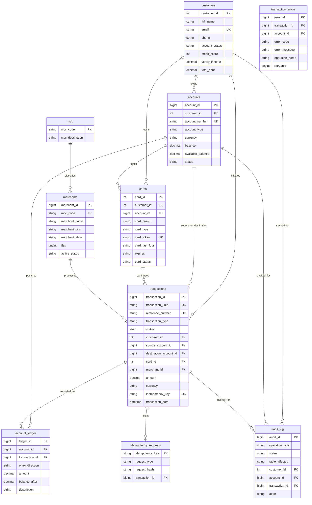

<div align="center">

# 🏦 Core Banking & Transaction Processing System

[](https://github.com)
[](https://python.org)
[](https://mysql.com)
[](https://flask.palletsprojects.com/)
[](LICENSE)

*An enterprise-grade, ACID-compliant banking system and transaction engine built with MySQL 8.0, stored procedures, double-entry ledger bookkeeping, idempotency guarantees, and a RESTful Python service layer.*

</div>

---

## 📑 Table of Contents

- [Overview & Architecture](#-overview--architecture)
- [Key Features](#-key-features)
- [System Architecture & Schema](#-system-architecture--schema)
- [Stored Procedures & Concurrency Control](#-stored-procedures--concurrency-control)
- [Quick Start](#-quick-start)
  - [Option A: Docker Compose (Recommended)](#option-a-docker-compose-recommended)
  - [Option B: Manual Setup](#option-b-manual-setup)
- [API Reference](#-api-reference)
- [Testing](#-testing)
- [ETL & Data Cleaning Pipeline](#-etl--data-cleaning-pipeline)
- [Project Structure](#-project-structure)
- [License](#-license)

---

## 🌟 Overview & Architecture

This repository delivers an end-to-end banking core capable of handling high-concurrency financial operations with strict consistency, auditability, and durability guarantees.

```
┌────────────────────────────────────────────────────────┐
│                   Client Applications                  │
└───────────────────────────┬────────────────────────────┘
                            │ HTTP / JSON
                            ▼
┌────────────────────────────────────────────────────────┐
│              Python Flask REST Service API             │
│      (Input Validation, Auth Context, Routing)         │
└───────────────────────────┬────────────────────────────┘
                            │ Stored Procedure Calls
                            ▼
┌────────────────────────────────────────────────────────┐
│           MySQL 8.0 ACID Database Engine               │
│  ┌──────────────────────────────────────────────────┐  │
│  │ Stored Procedures (Locking, Atomic Transitions)  │  │
│  ├──────────────────────────────────────────────────┤  │
│  │ Double-Entry Account Ledger (Credit / Debit)     │  │
│  ├──────────────────────────────────────────────────┤  │
│  │ Immutable Transaction Log & Idempotency Store    │  │
│  ├──────────────────────────────────────────────────┤  │
│  │ Triggers, Constraints & Audit Trail Logging      │  │
│  └──────────────────────────────────────────────────┘  │
└────────────────────────────────────────────────────────┘
```

---

## 🚀 Key Features

- **ACID Compliance & Isolation**: Financial transactions are isolated at `REPEATABLE READ` with strict pessimistic row-level locking (`FOR UPDATE`).
- **Deadlock Prevention**: Multi-account transfers dynamically order locks by ascending primary key (`account_id`), preventing cyclic lock wait-chains.
- **Double-Entry Ledger Integrity**: Every balance adjustment produces an immutable matching entry in `account_ledger`.
- **End-to-End Idempotency**: All mutating operations accept a unique `idempotency_key` (backed by SHA-256 request hashing) preventing duplicate processing on network retries.
- **Strict Business Triggers**:
  - Balance safety triggers prevent overdrafts and negative available balances.
  - Immutability triggers reject `UPDATE` or `DELETE` operations on finalized transaction rows.
- **Audit System**: Automatic recording of all actions (`ACCOUNT_CREATED`, `DEPOSIT`, `WITHDRAWAL`, `TRANSFER`, `ACCOUNT_CLOSED`) with actor stamps, error logs, and execution statuses.
- **Comprehensive Analytics Views**: Real-time aggregated views for daily transaction volume, high-value transfers, and account summaries.

---

## 🗄️ Database Design & Entity Relationship Diagram (ERD)

The system enforces strict relational integrity across 10 core tables with double-entry bookkeeping and auditing:



### Table Breakdown

| Table | Primary Key | Foreign Keys | Key Responsibilities |
| :--- | :--- | :--- | :--- |
| **`customers`** | `customer_id` | — | User profiles, KYC status, demographic data, and credit ratings. |
| **`accounts`** | `account_id` | `customer_id` | Financial accounts (Checking, Savings, Loan) with real-time balance checks. |
| **`cards`** | `card_id` | `customer_id`, `account_id` | Debit and Credit cards with tokenized identifiers (`card_token`). |
| **`mcc`** | `mcc_code` | — | Merchant Category Codes (ISO 18245 standard classification). |
| **`merchants`** | `merchant_id` | `mcc_code` | Merchant registry with category mapping, geolocation, and risk scoring. |
| **`transactions`** | `transaction_id` | `customer_id`, `source_account_id`, `destination_account_id`, `card_id`, `merchant_id` | Immutable ledger of all debits, credits, transfers, and purchases. |
| **`account_ledger`** | `ledger_id` | `account_id`, `transaction_id` | Double-entry journal records guaranteeing auditable balance history. |
| **`idempotency_requests`** | `idempotency_key` | `transaction_id` | Deduplication store with SHA-256 payload hashing. |
| **`audit_log`** | `audit_id` | `customer_id`, `account_id`, `transaction_id`, `card_id` | Security and compliance event trail. |
| **`transaction_errors`** | `error_id` | `transaction_id`, `account_id`, `card_id` | Failure telemetry and retry classification. |

---

## ⚙️ Stored Procedures & Concurrency Control

All transactional logic resides within database-level stored procedures to enforce atomicity and minimal network roundtrips:

- **`sp_create_account`**: Verifies active customer standing and creates accounts with optional opening balance.
- **`sp_close_account`**: Validates zero balance before marking accounts `CLOSED`.
- **`sp_deposit`**: Atomically updates account balance, writes transaction record, logs ledger entry, and audits.
- **`sp_withdraw`**: Checks available balance, locks account row, debits funds, and updates ledger.
- **`sp_transfer_funds`**: Atomically debits source account and credits destination account with deadlock-safe ordered locking.
- **`sp_get_account_summary`**: Fetches real-time balance and customer metadata.
- **`sp_get_transaction_history`**: Date-bounded, paginated transaction and ledger history.

---

## 🏁 Quick Start

### Option A: Docker Compose (Recommended)

Start both MySQL 8.0 (with automated schema provisioning) and the Python REST API with a single command:

```bash
docker compose up --build
```

The API will be available immediately at `http://localhost:5000`.

To seed initial sample data into the containerized database:

```bash
docker compose exec api python -m scripts.seed_demo_data
```

---

### Option B: Manual Setup

#### 1. Prerequisites
- Python 3.11+
- MySQL 8.0+

#### 2. Initialize MySQL Database
Run the consolidated master schema script:

```bash
mysql -u root -p < schema/init_schema.sql
```

#### 3. Setup Python Virtual Environment

```bash
python -m venv .venv

# On Windows:
.venv\Scripts\activate

# On Linux/macOS:
source .venv/bin/activate

pip install -r requirements.txt
pip install -r requirements-dev.txt
```

#### 4. Configure Environment Variables
Copy `.env.example` to `.env` and set your credentials:

```bash
cp .env.example .env
```

#### 5. Seed Demo Data

```bash
python -m scripts.seed_demo_data
```

#### 6. Start the Service API

```bash
python -m service.app
```

---

## 📡 API Reference

### Base URL: `http://127.0.0.1:5000`

### 1. Health Check
```http
GET /health
```
**Response (200 OK):**
```json
{
  "database": "bank_sys_final",
  "status": "healthy"
}
```

---

### 2. Create Account
```http
POST /accounts
Content-Type: application/json

{
  "customer_id": 1,
  "account_type": "CHECKING",
  "currency": "USD",
  "opening_balance": 1000.00,
  "actor": "api_client"
}
```
**Response (201 Created):**
```json
{
  "ok": true,
  "result": {
    "account_id": 101,
    "account_number": "AC0000000184A29F"
  }
}
```

---

### 3. Deposit Funds
```http
POST /accounts/101/deposit
Content-Type: application/json

{
  "amount": 250.00,
  "idempotency_key": "dep-req-9912",
  "actor": "teller_01"
}
```
**Response (200 OK):**
```json
{
  "ok": true,
  "result": {
    "reference_number": "DEP-9D092A64E59C",
    "status": "POSTED",
    "transaction_id": 501
  }
}
```

---

### 4. Withdraw Funds
```http
POST /accounts/101/withdraw
Content-Type: application/json

{
  "amount": 100.00,
  "idempotency_key": "wth-req-3301",
  "actor": "atm_device"
}
```
**Response (200 OK):**
```json
{
  "ok": true,
  "result": {
    "reference_number": "WTH-28C8110D77",
    "status": "POSTED",
    "transaction_id": 502
  }
}
```

---

### 5. Transfer Funds
```http
POST /transfers
Content-Type: application/json

{
  "source_account_id": 101,
  "destination_account_id": 102,
  "amount": 300.00,
  "idempotency_key": "trf-req-7788",
  "actor": "web_banking"
}
```
**Response (200 OK):**
```json
{
  "ok": true,
  "result": {
    "reference_number": "TRF-301FA82B9",
    "status": "POSTED",
    "transaction_id": 503
  }
}
```

---

### 6. Get Account Summary
```http
GET /accounts/101
```
**Response (200 OK):**
```json
{
  "ok": true,
  "result": {
    "account_id": 101,
    "account_number": "AC0000000184A29F",
    "account_type": "CHECKING",
    "available_balance": 850.00,
    "balance": 850.00,
    "currency": "USD",
    "customer_id": 1,
    "email": "alice.johnson@example.com",
    "full_name": "Alice Johnson",
    "status": "ACTIVE"
  }
}
```

---

### 7. Get Transaction History
```http
GET /accounts/101/history?limit=50
```
**Response (200 OK):**
```json
{
  "count": 3,
  "ok": true,
  "result": [
    {
      "amount": 300.00,
      "balance_after": 850.00,
      "currency": "USD",
      "description": "Transfer out",
      "entry_direction": "DEBIT",
      "reference_number": "TRF-301FA82B9",
      "status": "POSTED",
      "transaction_date": "2026-09-24T16:00:00",
      "transaction_id": 503,
      "transaction_type": "TRANSFER"
    }
  ]
}
```

---

### 8. Close Account
```http
POST /accounts/101/close
Content-Type: application/json

{
  "actor": "customer_service"
}
```
**Response (200 OK):**
```json
{
  "ok": true,
  "result": {
    "account_id": 101,
    "status": "CLOSED"
  }
}
```

---

## 🧪 Testing

### 1. Python Unit & API Test Suite
Run the automated test suite with pytest:

```bash
pytest
```

To view test coverage:

```bash
pytest --cov=service --cov-report=term-missing
```

### 2. MySQL Engine Smoke Test
Run integration and rollback verification scenarios directly on MySQL:

```bash
mysql -u root -p bank_sys_final < tests/mysql_smoke_test.sql
```

---

## 🧹 ETL & Data Cleaning Pipeline

The `cleaning_data/` directory contains batch pipelines designed for ingesting and cleaning legacy datasets:

| Script | Purpose |
| :--- | :--- |
| `01_cleaning_script1.py` | Sanitizes user income and debt currencies (`$`, commas) into standard floats. |
| `02_cleaning_script.py` | Hashes card tokens (SHA-256), parses expiration dates, and validates card numbers. |
| `03_cleaning_data.py` | Normalizes high-volume transactions, splits into 500k-row chunks, and generates SQL bulk loaders. |
| `04_cleaning_script.py` | Extracts and validates 4-digit Merchant Category Codes (MCC) from JSON datasets. |
| `05_cleaning_script.py` | Extracts merchant profiles, maps fraud flags, and prepares chunked bulk-import tables. |

---

## 📁 Project Structure

```
bank_system/
├── .github/
│   └── workflows/
│       └── ci.yml               # Automated GitHub Actions CI workflow
├── cleaning_data/               # ETL batch scripts for legacy data migration
│   ├── 01_cleaning_script1.py
│   ├── 02_cleaning_script.py
│   ├── 03_cleaning_data.py
│   ├── 04_cleaning_script.py
│   └── 05_cleaning_script.py
├── data/
│   ├── samples/                 # Lightweight sample datasets for quickstart
│   │   ├── sample_cards.csv
│   │   ├── sample_mcc.json
│   │   ├── sample_transactions.csv
│   │   └── sample_users.csv
│   └── .gitkeep
├── schema/                      # MySQL DDL, stored procedures & views
│   ├── init_schema.sql          # ⭐ Master database initialization script
│   ├── create_tables.sql        # Core DDL table definitions
│   ├── audit_system.sql         # Audit log and error tracking schema
│   ├── constraints.sql          # Check constraints & business triggers
│   ├── procedures_accounts.sql  # Account lifecycle stored procedures
│   ├── procedures_transactions.sql # Transactional stored procedures
│   ├── views_analytics.sql      # Financial analytics views
│   └── schema.puml              # PlantUML ERD model diagram
├── scripts/
│   └── seed_demo_data.py        # Demo data generator script
├── service/                     # Python Flask Service Layer
│   ├── __init__.py
│   ├── app.py                   # REST API application factory & endpoints
│   ├── banking_service.py       # Domain service interacting with MySQL procedures
│   └── config.py                # Environment configuration
├── tests/                       # Test Suite
│   ├── test_api.py              # API endpoint unit & integration tests
│   ├── test_banking_service.py  # Banking service business logic tests
│   └── mysql_smoke_test.sql     # Database smoke test script
├── .env.example                 # Example environment variables
├── .gitignore                   # Git ignore file (excludes large datasets & caches)
├── docker-compose.yml           # Multi-container orchestration (API + MySQL)
├── Dockerfile                   # Python container image definition
├── LICENSE                      # MIT License
├── pytest.ini                   # Pytest test discovery configuration
├── README.md                    # Project documentation
├── requirements.txt             # Production dependencies
└── requirements-dev.txt         # Development & testing dependencies
```

---

## 📄 License

This project is licensed under the [MIT License](LICENSE).